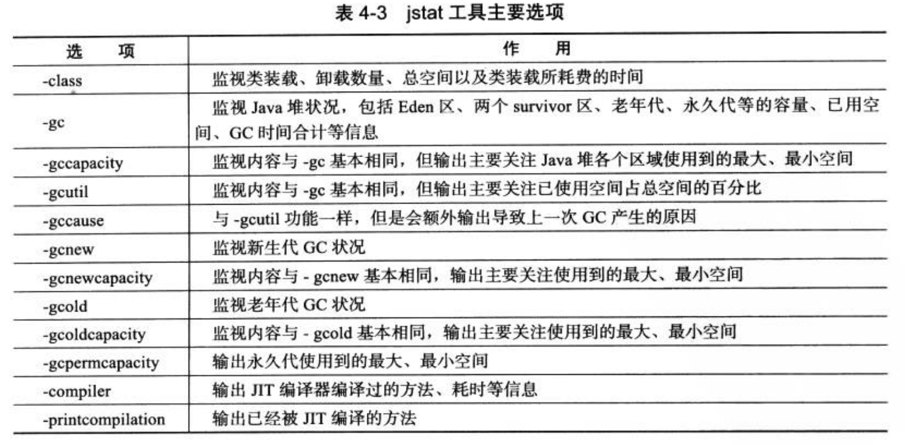
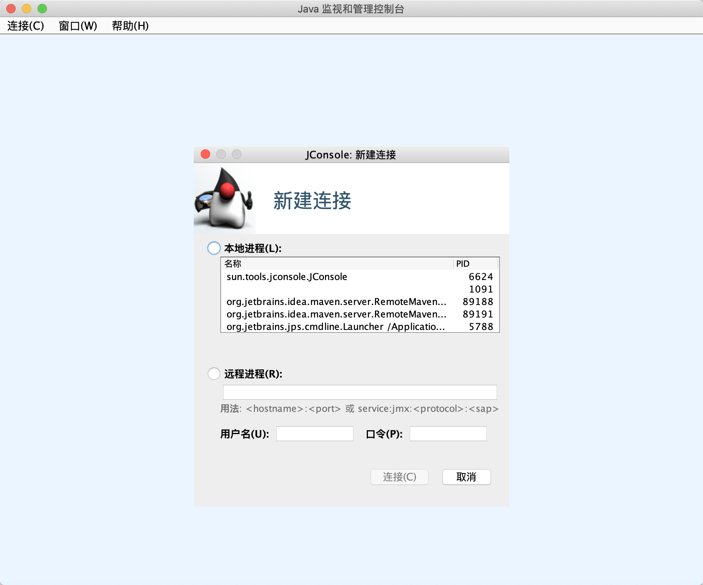
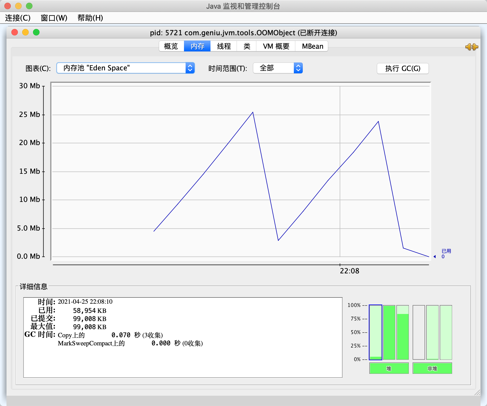
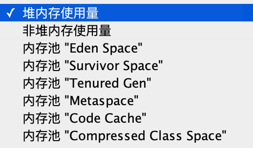
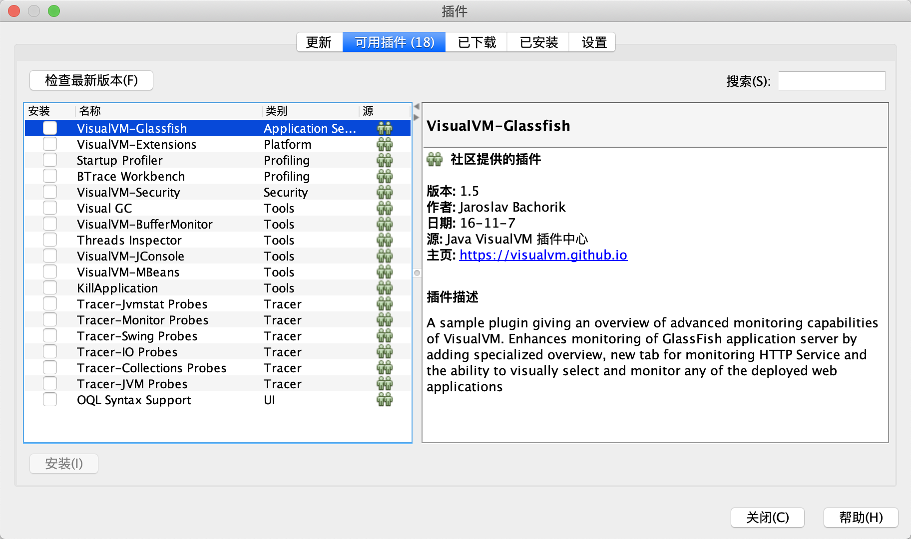

* content
{:toc}

## 1 jdk 自带工具之jstat——虚拟机进程状况工具

使用方式

```
Usage: jstat -help|-options
       jstat -<option> [-t] [-h<lines>] <vmid> [<interval> [<count>]]
```


例子1: 查看gc信息，每 250 秒查询一次，总共查询 20 次

```
jstat -gc pid 250 20
```




例子2:

其中 pid 可以通过 jdk 自带工具 jps（直接在命令行执行jps命令即可） 进行查看

```
jstat -gcutil 70159
  S0     S1     E      O      M     CCS    YGC     YGCT    FGC    FGCT     GCT   
  0.00   0.00  87.77  40.26  96.34  94.45     25    0.432     4    0.531    0.963
```

S0：代表 S0 区域使用占比 0%

S1：代表 S1 区域使用占比 0%

E: 代表 eden 区域使用比例为87.77%

O：代表老年代区域使用占比 40.26%

YGC：young GC 发生 25 次

YGCT：年轻代GC总耗时 0.432 秒

FGC：老年代GC总共发生4次

FGCT：老年代GC公共耗时 0.531 秒

GCT：GC 总共耗时 0.963秒


## 2 jdk自带工具之 jinfo——Java 配置信息工具


使用方式

```
Usage:
    jinfo [option] <pid>
        (to connect to running process)
    jinfo [option] <executable <core>
        (to connect to a core file)
    jinfo [option] [server_id@]<remote server IP or hostname>
        (to connect to remote debug server)

where <option> is one of:
    -flag <name>         to print the value of the named VM flag
    -flag [+|-]<name>    to enable or disable the named VM flag
    -flag <name>=<value> to set the named VM flag to the given value
    -flags               to print VM flags
    -sysprops            to print Java system properties
    <no option>          to print both of the above
    -h | -help           to print this help message
```

例子：查看指定VM参数值，这里是 CMS 垃圾回收器，占用多少内存会触发整理操作

```
jinfo -flag CMSInitiatingOccupancyFraction 70159
```

例子2: 查看VM所有参数


```
jinfo -flags 70159
```
 
## 3 jdk 自带工具之 jmap——Java 内存映像工具 

用来生成堆转储快照（一般称为heapdump或dump文件）。如果不实用jmap命令，

其他比较暴力的方式：

1、（-XX:+HeapDumpOnOutOfMemoryError）

2、-XX:HeapDumpOnCtrlBreak可以使用 ctrl + break 命令让虚拟机生成 dump 文件

3、在 Linux 系统，可以通过 kill -3 命令发送进程退出新号“吓唬”以下虚拟机，也能获取到 dump 文件。

使用方式：

```
Usage:
    jmap [option] <pid>
        (to connect to running process)
    jmap [option] <executable <core>
        (to connect to a core file)
    jmap [option] [server_id@]<remote server IP or hostname>
        (to connect to remote debug server)

where <option> is one of:
    <none>               to print same info as Solaris pmap
    -heap                to print java heap summary
    -histo[:live]        to print histogram of java object heap; if the "live"
                         suboption is specified, only count live objects
    -clstats             to print class loader statistics
    -finalizerinfo       to print information on objects awaiting finalization
    -dump:<dump-options> to dump java heap in hprof binary format
                         dump-options:
                           live         dump only live objects; if not specified,
                                        all objects in the heap are dumped.
                           format=b     binary format
                           file=<file>  dump heap to <file>
                         Example: jmap -dump:live,format=b,file=heap.bin <pid>
    -F                   force. Use with -dump:<dump-options> <pid> or -histo
                         to force a heap dump or histogram when <pid> does not
                         respond. The "live" suboption is not supported
                         in this mode.
    -h | -help           to print this help message
    -J<flag>             to pass <flag> directly to the runtime system
```

例子：生成 dump 文件

```
jmap -dump:format=b,file=eclipse.bin 2500
```

## 4 jhat：虚拟机堆转储快照分析工具

一般不用，一个是因为：一般不会在部署应用程序的服务器上直接分析dump，因为分析demp文件是一个耗时而且消耗硬件资源的操作；二是因为jhat的分析功能相对来说比较简陋。一般可以使用 Eclipse Memory Analyzer或者IBM HeapAnalyzer等工具。

如果需要使用，可以参照博客：mac平台下怎么分析java堆hprof文件 https://blog.csdn.net/Prepared/article/details/115589701

## 5 jstack：Java堆栈跟踪工具

主要是用来生成线程快照，用于分析定位线程出现长时间停顿的原因，如线程间死锁、死循环、请求外部资源导致的长时间等待。

```
Usage:
    jstack [-l] <pid>
        (to connect to running process)
    jstack -F [-m] [-l] <pid>
        (to connect to a hung process)
    jstack [-m] [-l] <executable> <core>
        (to connect to a core file)
    jstack [-m] [-l] [server_id@]<remote server IP or hostname>
        (to connect to a remote debug server)

Options:
    -F  当正常输出的请求不被响应时，强制输出线程堆栈
    -m  如果调用到本地方法的话，可以显示C/C++的堆栈
    -l  除堆栈外，显示关于锁的附加信息
    -h or -help to print this help message
```

jdk1.5之后，Thread类提供了 getAllStackTraces() 可以获取虚拟机中所有线程的 StackTraceElement 对象，可以完成大部分jstack功能，可以用这个做一个界面。

## 6 JConsole: Java 监视与管理控制台

mac系统，直接在控制台执行命令：`jconsole` 启动相应的界面





选择要监控的进程




查看对应进程的堆、新生代、老年代内存情况



## 7 VisualVM: 多合一故障处理工具

mac系统，直接在控制台执行命令：`jvisualvm` 启动相应的界面


优点：

1. 到目前为止随JDK发布的功能最强大的运行监控和故障处理程序；
2. 除了运行监控、故障处理，还提供性能分析等能力；
3. 对应用程序的实际性能的影响很小，可以直接在生产环境中使用。

功能范围：

1. 显示虚拟机进程以及进程的配置、环境信息（jps、jinfo）；
2. 监视应用程序的 CPU、GC、堆、方法区以及线程信息（jstack、jstat）；
3. dump以及分析堆转储快照（jmap、jhat）；
4. 方法及的程序运行性能分析，找出调用最多、运行时间最长的方法；
5. 离线程序快照：收集程序的运行时配置、线程dump、内存dump等信息建立快照，可将快照发给开发进行Bug反馈；

安装相应的插件，更好的使用该工具。




