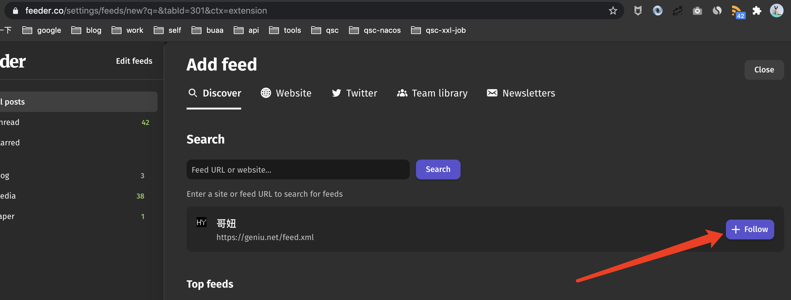

* content
{:toc}

很多国内程序员可能都有这种疑惑，去哪里看技术圈最新的消息？怎么知道厂都在用什么技术？做什么？怎么知道圈内最新的paper？怎么跟踪国内外技术大佬的博客？

如果你有上述这些疑惑，那么本文适合你读下去。

本文使用 RSS 订阅相关博客、最新paper、大厂技术追踪、圈内技术视频。

## 什么是 RSS

> RSS (RDF Site Summary or Really Simple Syndication)is a web feedthat allows users and applications to access updates to websites in a standardized, computer-readable format.

引用 Wikipedia 上的解释：RSS 是让用户和应用可以追踪网站的更新，然后以一种标准化、电脑可读的格式进行展示的web feed。

## 怎么用

## 下载以及界面说明

使用 Google Chrome 扩展程序，搜索`RSS Feed Reader` 进行安装（需要翻墙），安装好之后，可以固定在 Google Chrome 的工具栏中。

注册一个账号，不注册账号也可以，但是如果换一台电脑，千辛万苦关注的那些内容就丢失了。

登陆之后打开设置，切换到主页。这里包含了所有你关注链接的实时更新，包括已读的和未读的；以及你设置的分类文件夹。

看到这里，你可能有个疑问了，怎么关注一个链接（技术大佬博客、大厂技术博客、youtube账号）呢？马上告诉你。

### 如何订阅一个博客

有两种方式

1、第一种方式（建议使用）

1）打开一个网站，看浏览器工具栏中的RSS右上角是否有个+号（如下图所示），如果有，说明这个网站可以通过RSS进行订阅更新（没有不代表不能通过RSS订阅哟）。

2）点击RSS图标，会有RSS弹框，然后点击`+`号

3）到RSS主界面，点击`Follow`按钮即可，可能有多个，但是主要的更新就一个，另外一个是关于评论的

4）选择分类名称，以及追踪频率，默认即可

是不是很简单，手动狗头

2、第二种方式（第一种方式不能用的时候使用）

1）进入RSS主界面，点击左侧按钮`Add Feed`，选择`website` tab标签

2）填入要追踪的网址，这里是 https://www.geniu.net/，点击`Submit Url`

3）选择要关注的区域，发现有Math的内容，然后点击Save

4）选择分类名称，以及追踪频率，默认即可

ps：其实还有一种方式，直接输入网站，后面加`feed.xml`或者`atom.xml`等标准后缀，看是否有结果，感觉不是特别靠谱～

## 推荐一些可以关注的内容

1、可以查看，左耳朵耗子的极客时间《左耳听风》：https://time.geekbang.org/column/article/12561

应该不买课程，也可以看几篇

2、自己喜欢的博主，不管是csdn、oschina还是github等都可以关注（精确到具体博主）

3、大厂技术博客：比如美团：https://tech.meituan.com/等等，自己可以查找一下。

如果有问题，欢迎随时找我～

